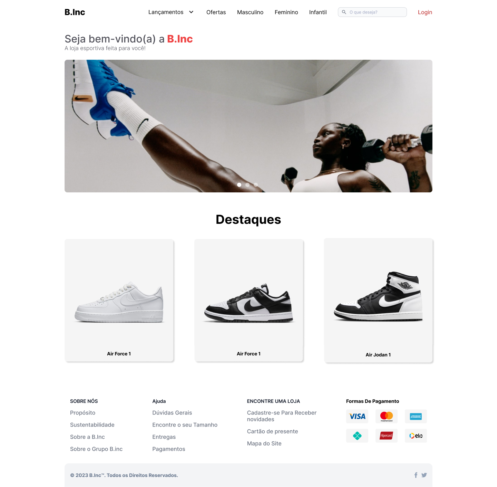
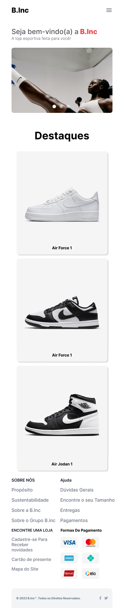
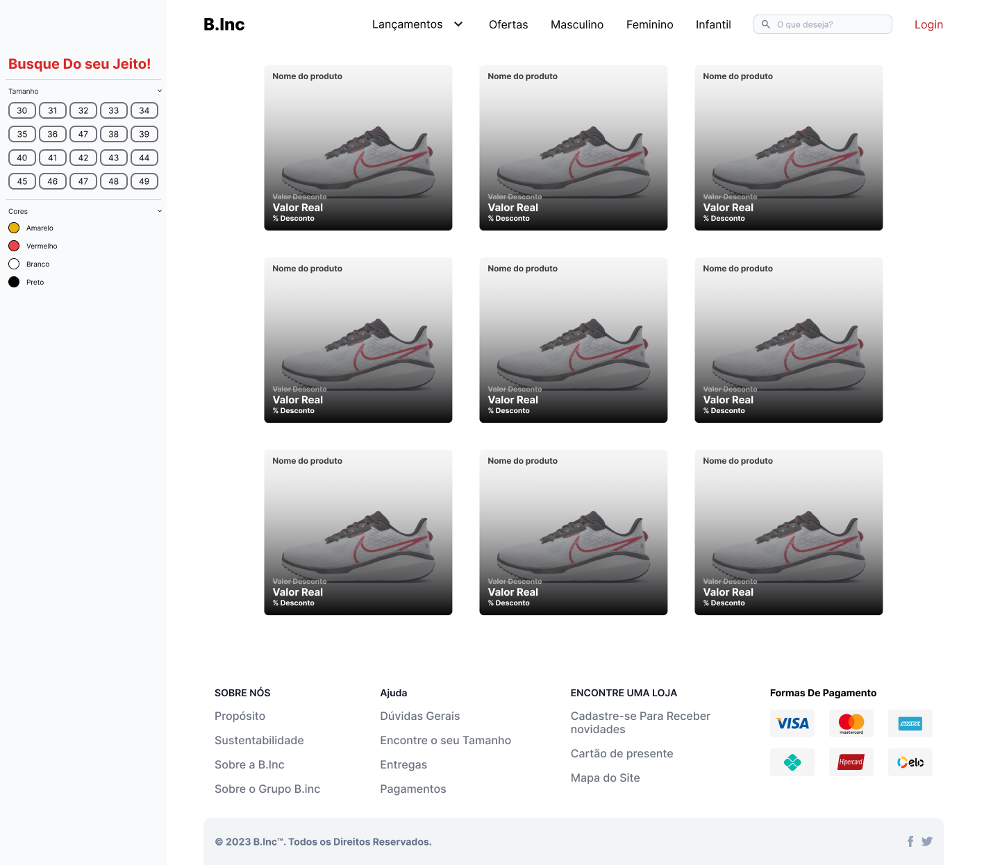
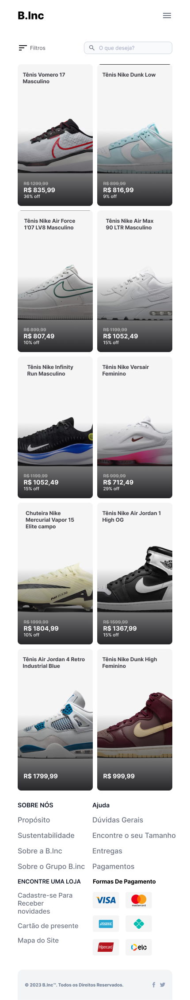

<h1 style="text-align: center;">B.Inc</h1>

Projeto desenvolvido na matéria de IHC do curso de Desenvolvimento de Sistemas pelo SENAI - Alagoinhas

Professor e Orientador: Gizelle Karine

## Escopo
Projeto visa desenvolver um e-commerce com tema livre para escolha do aluno.

+ Tema: Site para venda de Tênis

## Protótipo

Home Desktop

Home Mobile

Pagina de Produtos Desktop

Pagina de Produtos Mobile

## Stacks

  